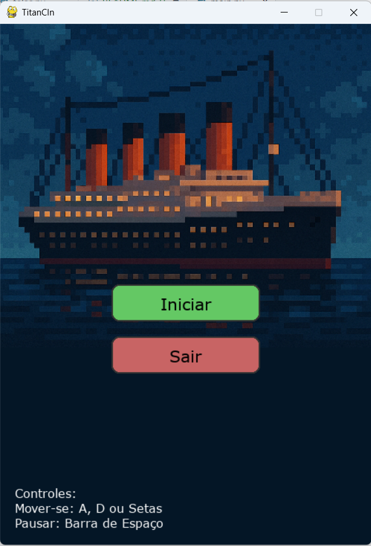
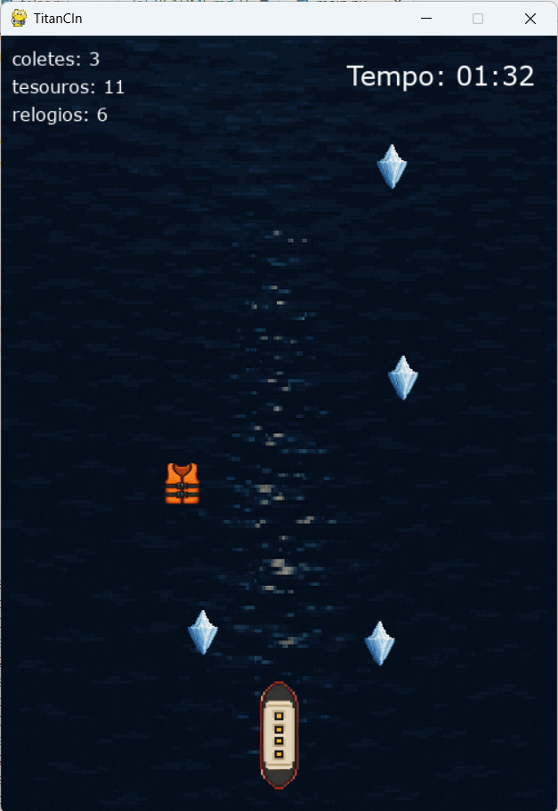
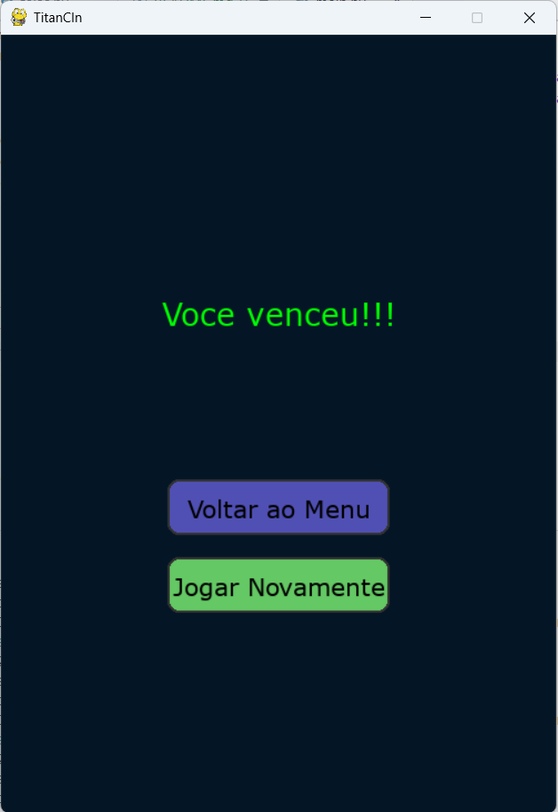

# 🚢 TitanCIn 1912

## ❓ Sobre o Projeto

Jogo desenvolvido em Python com o uso da biblioteca PyGame, inspirado no navio Titanic. O jogador deve coletar 3 tipos de itens, enquanto o tempo diminui e ele desvia de obstáculos.

## 👥 Equipe e Divisão de Trabalho

- **Alice Santana `<ass11>`**: Criação dos objetos coletáveis, imagens e arquitetura do projeto  
- **Kraus Jatobá `<kjsj>`**: Criação dos obstáculos, sons e criação objeto jogador
- **Lucas Teixeira `<lta>`**: Criação dos objetos coletáveis, organização das pastas e criação do protótipo  
- **Marcos Alexandre `<malb>`**: Criação da lógica do jogo, contadores e telas  

## 🧠 Arquitetura do Projeto

O projeto segue o paradigma de Orientação a Objetos e está estruturado da seguinte forma:

- `main.py`: ponto de entrada do jogo, onde o loop principal é iniciado  
- `titanic.py`: classe do navio controlado pelo jogador  
- `coletaveis.py`: define os itens coletáveis — coletes salva-vidas, relógios e baús de tesouros  
- `iceberg.py`: classe responsável pelos obstáculos do tipo iceberg  
- `main.py`: gerencia a lógica geral do jogo, como colisões, pontuação e movimentação dos objetos

## 🖼️ Capturas de Tela

### Tela Inicial  

### Em Jogo  

### Game Over  

## 🛠️ Ferramentas, Bibliotecas e Frameworks

- **Python 3**: Linguagem aprendida na disciplina e utilizada no projeto
- **PyGame**: Biblioteca para desenvolvimento de jogos 2D, oferece uma estrutura acessível para jogos com suporte a sprites, colisões, áudio e controle de eventos  
- **VSCode**: Editor de código utilizado juntamente com o Git para versionamento dos códigos
- **GitHub**: Utilizado para armazenar os arquivos e colaborar com a equipe  

## 💡 Conceitos Utilizados

- **Orientação a Objetos**: Para criar cada elemento do jogo a partir de classes
- **Estruturas condicionais**: Utilizadas na hora de fazer a lógica do jogo, determinando o que fazer em determinadas situações
- **Laços de repetição**: Para criar a quantidade de obstáculos e coletáveis que aparecem na tela
- **Funções**: Para criar movimentações, os objetos coletáveis e os obstáculos

## 💥 Desafios e Lições Aprendidas

### ❌ Maior Erro

O maior erro foi nos preocuparmos demais com a parte estética antes mesmo de termos toda a lógica do jogo definida.

**Como resolvemos**: Discutimos como seria a lógica do jogo e focamos nisso.

### 🧊 Maior Desafio

Entender a Programação Orientada a Objetos.

**Como resolvemos**: Procuramos materiais e projetos parecidos com o que queríamos fazer para nos inspirarmos.

### 📚 Lições Aprendidas

- A relevância da comunicação e do acompanhamento contínuo no projeto, tanto em grupo como com os monitores e professor.

## ▶️ Como Rodar o Projeto

### 🧩 1. Clonando ou Baixando o Repositório

#### 🔁 Clonar com Git
git clone https://github.com/aliecsantana/projeto-ip.git
cd projeto-ip

#### 🐍 2. Instalando o Python 3.13.3
Acesse: https://www.python.org/downloads/release/python-3133/
Baixe o instalador correspondente ao seu sistema operacional e marque a opção "Add Python to PATH" durante a instalação.

#### 📦 3. Instalando o PyGame
No terminal, execute:
pip install pygame

#### ▶️ 4. Executando o Arquivo main.py
Certifique-se de estar na pasta correta e execute:
python main.py
